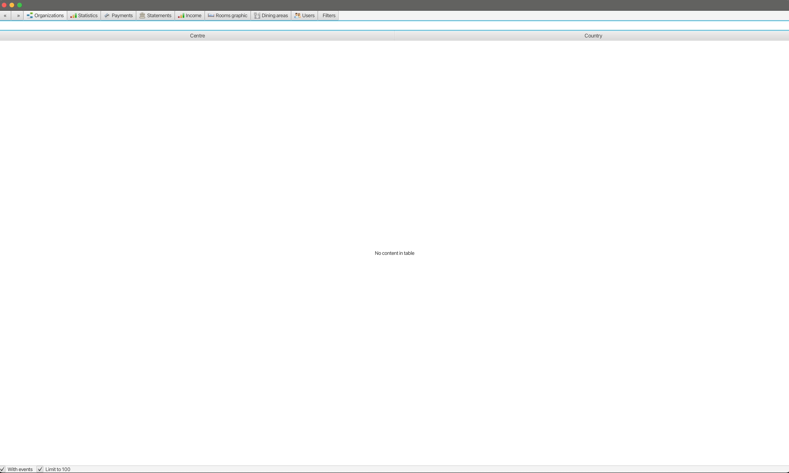

= Modality Documentation
:icons: font
:toc: left
:toclevels: 2
:source-highlighter: pygments
Last updated: {docdate}

== Introduction
=== What is Modality?
Modality is a Java-based, modular, hospitality-oriented booking system. Multiple organisations, events and properties are supported, together with a wide range of hospitality-related add-ons, such as meals, transport, translation, special needs and more.

=== Why the name?
'Modality' is a fusion of two words, 'modular' and 'hospitality', a nod to both the software's design and purpose.

== The Modality Architecture
Modality is developed using the following technologies:

[cols="1,1,1"]
|===
| Technology | Purpose | Version

| link:https://www.oracle.com/java/technologies/downloads/[Java] | Codebase | 18
| link:https://openjfx.io/[JavaFX] | Desktop + mobile user interfaces | 18
| link:https://docs.webfx.dev/[WebFX] | Web user interfaces | Latest (Beta)
|===

...consists of three end-user client applications:

[cols="1,1,1"]
|===
| Application | Used By | Compilation Toolchain

| Front-Office (Mobile) | Customer | Gluon
| Front-Office (Web) | Customer | WebFX + GWT
| Back-Office (Web) | Administrator | WebFX + GWT
|===

...two developer client applications:

[cols="1,1,1"]
|===
| Application | Used By | Compilation Toolchain

| Back-Office (Desktop) | Developer | JavaFX
| Front-Office (Desktop) | Developer | JavaFX
|===

...one web server:

[cols="1,1,1"]
|===
| Application | Purpose | Version

| link:https://vertx.io/[Vert.x] | Interface between client apps and back-end services; serves the SPA | Latest
|===

...and depends on the following services:

[cols="1,1,1"]
|===
| Service | Purpose | Version

| link:https://www.postgresql.org/[Postgres] | Database | 14.2
| link:https://redis.io/[Redis] | Session management | 6.2.6
| link:https://flywaydb.org/[Flyway] | Database schema updates | Latest
|===

The services are orchestrated by link:https://www.docker.com/products/docker-desktop/[Docker] when running Modality on localhost (instructions given later in this document).

=== Native web applications
Modality is the first large-scale Java project to use link:docs.webfx.dev[WebFX] - a toolkit that transpiles JavaFX applications into pure JavaScript web apps for direct execution in the browser.

=== Native mobile applications
Modality uses the link:https://gluonhq.com/products/mobile/[Gluon] toolchain to compile the codebase into native, installable apps ready for inclusion into the Google Play and Apple App store.

=== Native desktop applications
Modality also provides desktop apps, which provide exactly the same UI as the web apps generated from the same source. This is useful for developers, allowing Java code to be rapidly developed and tested via the desktop, before subsequent transpilation into JavaScript and mobile (which takes time).

== Installation
=== 1. Create the Modality root

 mkdir -vp modality
 export MODALITY_ROOT=${PWD}/modality

=== 2. Clone the codebase
Git clone the Modality codebase via the terminal (or IntelliJ etc):

 cd $MODALITY_ROOT
 git clone https://github.com/mongoose-project/modality.git .

=== 3. Install Docker
Modality uses Docker for all external services, including the database and the in-memory datastore for sessions.

Please install Docker on your local machine if you do not have it already. If using a Mac, the easiest way is to install using `brew`. Please provide Docker with a minimum of 8GB of RAM, ideally more.

NOTE: Insufficient RAM may result in `java.lang.OutOfMemoryError` errors when importing the link:https://github.com/mongoose-project/modality-dev-db[modality-dev-db^].

=== 4. Prepare Docker environment variables
Environment variables store the Postgres database name, username and password. Defaults are provided in the `.env-template`. Use this template file as the basis for your Docker-based configuration, by creating an `.env` file from it. You may leave the defaults, or provide new values accordingly:

 cd $MODALITY_ROOT/docker
 cp .env-template .env
 source .env # make the environment variables available to the shell

=== 5. Build the Docker containers
 cd $MODALITY_ROOT/docker
 docker-compose build --no-cache

=== 6. Start the containers to build the database
 cd $MODALITY_ROOT/docker
 docker-compose up

The database scripts are stored in the `modality-base/modality-base-server-datasource/src/main/resources/db/` folder, and are executed sequentially by the link:https://flywaydb.org/[Flyway^] database version control container. Please allow several minutes for Flyway to complete. Once finished, you will now up and running with all the external services that Modality depends on.

=== 7. Install IntelliJ IDEA
We develop Modality using the free, community edition of link:https://www.jetbrains.com/idea/[IntelliJ IDEA], and recommend you install this if you do not already have an IDE. IntelliJ allows you to easily compile and run the Modality server and clients, for the purpose of local development and testing.

NOTE: All subsequent IDE-based examples given in this documentation will be based on IntelliJ.

== Configure Modality for localhost
=== Create a Run Configuration for Modality Server
In order to run any of the Modality client applications, the Modality Server should first be running. The Modality Server is a link:https://vertx.io/[Vert.x] server that proxies requests to the database and is responsible for establishing and maintaining user sessions.

The easiest way to stand up the server locally is to create an application run configuration in your IDE.

In the IntelliJ menu, click `Run -> Edit Configurations` to display the following dialog, and populate with the same details:

image::run-configuration-modality-server-1.png[]
image::run-configuration-modality-server-2.png[]

Click 'OK' to save the configuration and close the dialog.

=== Create a Run Configuration for Modality Back-Office (Desktop) client
The Modality Back-Office (Desktop) client is the application used by administrators of Modality, and is where new organisations and events are created etc.

Create another run configuration and populate it with the details given in the screenshot below:

image::run-configuration-modality-back-office-1.png[]

Click 'OK' to save the configuration and close the dialog.

=== Create a Run Configuration for Modality Back-Office (Web) client
NOTE: Documentation not yet available.

=== Create a Run Configuration for Modality Front-Office (Mobile) client
NOTE: Documentation not yet available.

=== Create a Run Configuration for Modality Front-Office (Web) client
NOTE: Documentation not yet available.

== Run Modality on localhost
The Modality clients run independently of each other, but all require the Modality Server to be running, which in turn requires Docker to be running the service containers described above. Therefore, the first two steps below are mandatory before running one or more of the Modality clients locally.

=== Ensure Docker is running [red]***
 cd $MODALITY_ROOT/docker
 docker-compose up

=== Start the Modality Server [red]***
Start the Modality server by executing the run configuration:

image::run-modality-server-locally-1.png[]

=== Start Modality Back-Office (Desktop) client
Start the Modality Back-Office (Desktop) client by executing run configuration:

image::run-modality-back-office-desktop-locally-1.png[]

The Back-Office (Desktop) client should then display:

=== Start Modality Back-Office (Web) client
NOTE: Documentation not yet available.

=== Start Modality Front-Office (Mobile) client
NOTE: Documentation not yet available.

=== Start the Modality Front-Office (Web) client
NOTE: Documentation not yet available.

== Modality Database
All database setup scripts are stored in the `modality-base/modality-base-server-datasource/src/main/resources/db/` folder, and are numbered in order of execution. Execution of the database scripts is performed automatically by the Flyway container, which runs on Docker startup. All the data is stored on the host, in directory:

 $MODALITY_ROOT/docker/data/postgres/*

This provides persistence, and the container can be safely shut down and restarted without losing data.

Any new database scripts must be:

<1> added to the same `modality-base/modality-base-server-datasource/src/main/resources/db/` folder
<2> named according to the convention used in the folder: `V{number}__{desc}.sql`

Once a new script has been added to the folder, the Flyway container should be restarted, in order to apply the change. The easiest way to do this is to simply restart docker-compose:

 cd $MODALITY_ROOT/docker
 docker-compose down
 docker-compose up

== Modality Development Database
The Modality project additionally provides a development database that is pre-populated with test data, available from the link:https://github.com/mongoose-project/modality-dev-db[modality-dev-db^] repository.

If you wish to import this database, you will need to:

<1> shut down the Modality server
<2> shut down the docker containers
<3> delete the `docker/data/` folder
<4> download the link:https://github.com/mongoose-project/modality-dev-db[modality-dev-db^] repository
<5> decompress the `V0001__modality_dev_db.sql.zip` file in the modality-dev-db repository
<6> move the unzipped `V0001__modality_dev_db.sql` to the `modality-base/modality-base-server-datasource/src/main/resources/db/` folder
<7> move all the other scripts temporarily out of the folder
<8> restart the docker containers - this will auto-import the development database
<9> wait until the import is complete. Due to the size of the development database, it can take 20+ minutes to import. Modality will not be usable during this time.

== Modality Session
The session data is controlled by the docker-based Redis container and is not persisted locally. The data persists only as long as the container is running.

== Using Docker
=== Connect to the Docker database container
Connection is easily made via any Postgres client (e.g. DBeaver). Use the following credentials (contained within the `docker/.env-template` file):

* Server: 127.0.0.1
* Port: 5432
* Database: modality
* User: modality
* Password: modality

=== Connect to the Docker session container
Connection can be made through the Docker terminal:

 cd $MODALITY_ROOT/docker
 docker exec -ti session /bin/sh
 redis-cli
 keys *

=== Shut down Docker

 cd $MODALITY_ROOT/docker
 docker-compose down

=== Destroy & rebuild the Docker containers
Sometimes you will want a fresh set of containers. The simplest way to do this is:

 cd $MODALITY_ROOT/docker
 docker-compose down
 docker ps -a # Lists all Docker containers
 docker rm <container-id> # Remove any docker containers listed
 docker images # Lists all Docker images
 docker image rm <image-id> # Remove any docker images listed
 docker volume ls # Lists all Docker volumes
 docker volume rm <volume-id> # Remove all docker volumes listed
 docker system prune # Removes build cache, networks and dangling images
 rm -rf data # Removes locally stored database tables

You can now rebuild the Docker containers:

 docker-compose build --no-cache
 docker-compose up

== Deploy Modality to Heroku
NOTE: Procedures for this coming soon!

ifdef::backend-html5[]
== PDF version
Here is the
link:modality-docs.pdf[PDF version,float="right"]
of this documentation.
endif::[]
