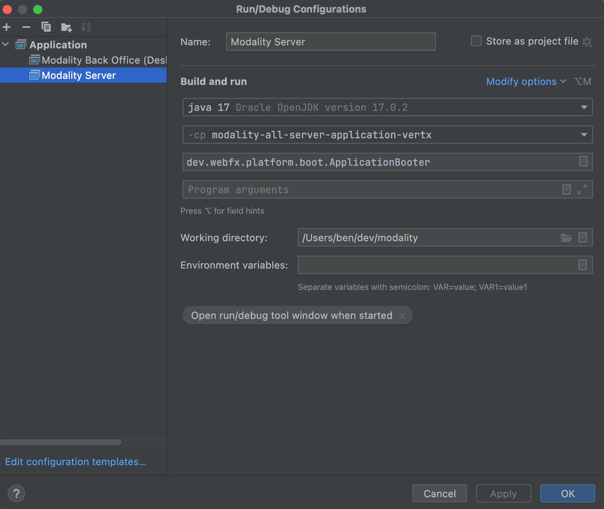
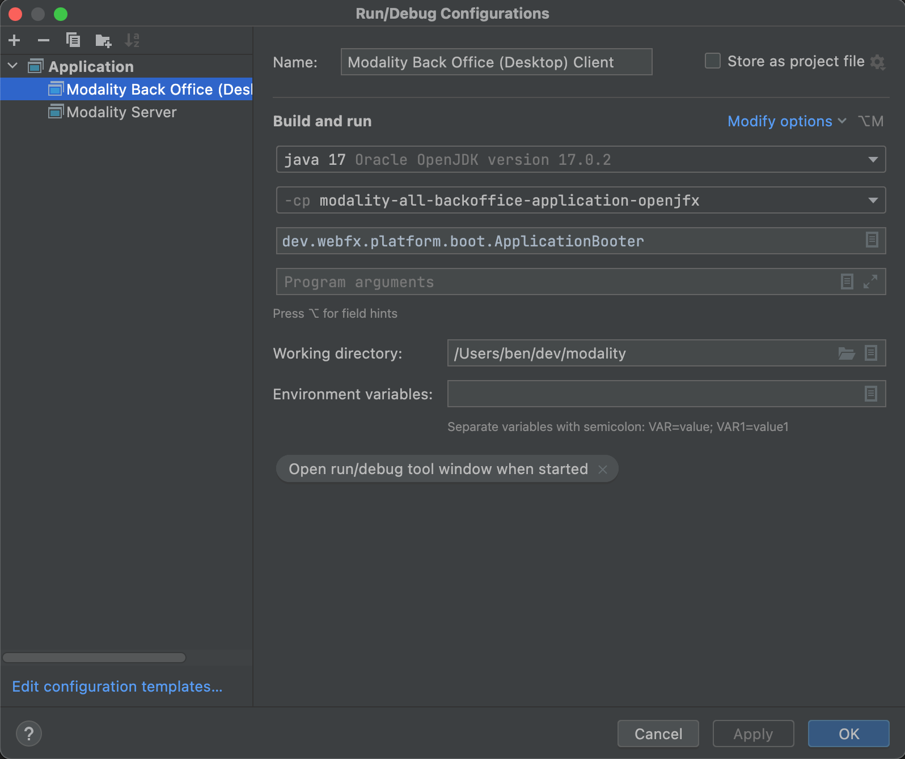

= Modality Documentation
:icons: font
:toc:
:toclevels: 2
:source-highlighter: pygments
Last updated: {docdate}

== Installation
=== 1. Install Java JDK
Modality is developed entirely in the Java language, and requires at least JDK 17+. Check whether this is installed:

 java --version

If it is not installed, or is an older version, please refer to link:https://docs.oracle.com/en/java/javase/17/install/overview-jdk-installation.html[this guide^].

=== 2. Install WebFX CLI
We use the WebFX CLI to compile Modality for the web. Please follow this link:https://docs.webfx.dev/#_installing_the_webfx_cli[guide^] to install it.

=== 3. Install IntelliJ IDEA
We develop Modality using the free, community edition of link:https://www.jetbrains.com/idea/[IntelliJ IDEA^], and recommend you install this if you do not already have an IDE. IntelliJ allows you to easily compile and run the Modality server and clients, for the purpose of local development and testing.

NOTE: All subsequent IDE-based examples given in this documentation will be based on IntelliJ.

=== 4. Install Git
A git client is needed to retrieve the Modality codebase from GitHub. Check if git is installed:

 git --version

If it is not installed, you may wish to refer to link:https://www.linode.com/docs/guides/how-to-install-git-on-linux-mac-and-windows/[this guide^].

=== 5. Create the Modality root

 mkdir -vp modality
 export MODALITY_ROOT=${PWD}/modality

=== 6. Clone the codebase
Git clone the Modality codebase via the terminal (or IntelliJ etc):

 cd $MODALITY_ROOT
 git clone https://github.com/modalityone/modality.git .

=== 7. Install Postgres database
You may choose to install this natively, or you can use the link:https://github.com/modalityone/modality-local-services[modality-local-services^] repository. This contains a Docker-based solution to easily stand up Postgres on your machine, and includes appropriate configuration details to work with the Modality defaults.

=== 8. Apply SQL to Postgres database
Modality expects a database and set of tables. They can be built using the following SQL scripts:

 `$MODALITY_ROOT/modality-base/modality-base-server-datasource/src/main/resources/db-pristine/*.sql`

Either apply the SQL scripts manually to your locally-installed Postgres database, or, if you are using the Docker-based solution we provide, then add them to the following folder:

 `$MODALITY_LOCAL_SERVICES/docker/data/postgres/`

== Configure Modality for Development
=== Resolve all Modality Dependencies
Open Modality in IntelliJ and wait for all dependencies to be automatically resolved:

=== Modality Server
In order to run any of the Modality client applications, the Modality Server should first be running. The Modality Server is a link:https://vertx.io/[Vert.x^] server that proxies requests to the database and is responsible for establishing and maintaining user sessions.

The easiest way to stand up the server locally is to create an application run configuration in the IDE.

In the IntelliJ menu, click `Run -> Edit Configurations` to display the following dialog, and populate with the same details:

image::run-configuration-modality-server-1.png[]

Click 'OK' to save the configuration and close the dialog.

=== Back-Office Desktop
The Back-Office Desktop client is an application used by developers of Modality, and emulates the Web user interface used by administrators of the system. The idea is that developers build/modify screens using this client, then finally compile it for the Web using WebFX.

Create another run configuration and populate it with the details given in the screenshot below:

Click 'OK' to save the configuration and close the dialog.

=== Front-Office Desktop
NOTE: The Front-Office Desktop client is not yet implemented.

== Build & Run Modality on Development
The Modality clients run independently of each other, but all require the Modality Server to be running, which in turn requires Postgres to be running. Therefore, the first two steps below are mandatory before running one or more of the Modality clients locally.

=== Postgres [red]***
Ensure that Postgres is running.

=== Modality Server [red]***
Build and run the server by executing its run configuration:

=== Back-Office Desktop
Build and run the Back-Office Desktop client by executing its configuration:

image::run-modality-back-office-desktop-locally-1.png[]

The Back-Office Desktop client will then be ready to use.

=== Back-Office Web
<1> First *build* the index.html file:

 cd $MODALITY_ROOT
 webfx build --gwt

<2> Then *locate* the resultant index.html file on the filesystem:

 webfx build --gwt --locate

<3> In the IntelliJ Project window, navigate to the index file and double click.

<4> Hover the mouse over the index.html source code to display the browser options.

<5> Click on one of the browser icons to run the index.html in a browser.

=== Back-Office Tablet
Full instructions (and limitations) for compiling the codebase to native Android and iOS apps are available on the WebFX documentation site link:https://docs.webfx.dev/#_android_platform[here].

=== Front-Office Desktop
NOTE: The Front-Office Desktop client is not yet implemented.

=== Front-Office Web
NOTE: The Front-Office Web client is not yet implemented.

=== Front-Office Mobile
NOTE: The Front-Office Mobile client is not yet implemented.

ifdef::backend-html5[]
== PDF version
Here is the
link:modality-docs.pdf[PDF version,float="right"]
of this documentation.
endif::[]
